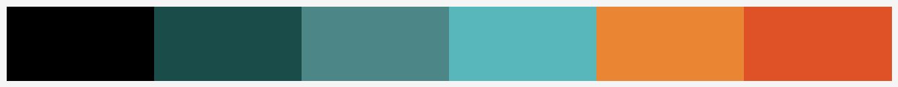

Brand Utilities
===============

Overview
--------

Brand assets and image helpers for DRC identity workflows.

Palette
-------

Canonical brand colors are exposed in ``drcutils.brand.COLORS`` and named
constants:

.. list-table::
   :header-rows: 1

   * - Name
     - Hex
   * - ``BLACK``
     - ``#000000``
   * - ``DARK_TEAL``
     - ``#1A4C49``
   * - ``TEAL``
     - ``#4D8687``
   * - ``BLUE``
     - ``#57B7BA``
   * - ``ORANGE``
     - ``#EA8534``
   * - ``RED``
     - ``#DF5127``

Logo Samples
------------

Typography Guidance
-------------------

- Primary family: ``Magdelin`` (headers, all caps).
- Secondary family: ``Zilla Slab`` (body text).
- Use ``get_matplotlib_font_fallbacks()`` for plotting-friendly fallback stacks.

Asset Resolver Examples
-----------------------

.. code-block:: python

   from drcutils.brand import (
       get_circle_graphic_path,
       get_gradient_paths,
       get_logo_path,
       get_pattern_path,
       get_scribble_path,
   )

   symbol_white = get_logo_path("symbol", "white")
   stacked_on_black = get_logo_path("stacked", "full", on_black=True)
   pattern = get_pattern_path("grey")
   gradients = get_gradient_paths()
   circle = get_circle_graphic_path("blue")
   scribble = get_scribble_path("thick", "dark_teal")

Watermark Example
-----------------

.. code-block:: python

   from drcutils.brand import watermark

   watermark(
       "artifacts/figure.png",
       output_filepath="artifacts/figure_watermarked.png",
       logo_layout="stacked",
       logo_variant="auto",
       on_black="auto",
       box=[0.02, 0.02, 0.12, None],
   )

Variant Matrix
--------------

- ``horizontal`` logo variants: ``full``, ``black``, ``dark_teal``, ``red``, ``white``.
- ``stacked`` logo variants: ``full``, ``black``, ``dark_teal``, ``red``, ``white``.
- ``symbol`` logo variants: ``full``, ``black``, ``dark_teal``, ``blue``, ``teal``,
  ``orange``, ``red``, ``white``.
- ``on_black=True`` uses dedicated high-contrast logos for ``horizontal``,
  ``stacked``, and ``symbol`` layouts.

API Reference
-------------

.. automodule:: drcutils.brand
   :members:
